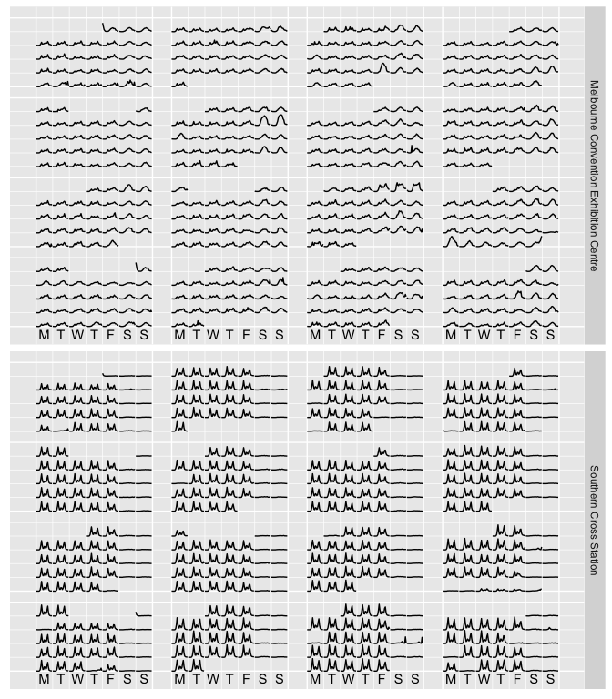

<!-- README.md is generated from README.Rmd. Please edit that file -->
sugrrants
=========

[](https://travis-ci.org/earowang/sugrrants)

Overview
--------

The goal of *sugrrants* is to provide supporting graphics with R for analysing time series data. It aims to fit into the *tidyverse* and grammar of graphics framework for handling with temporal data. The package is under development and highly experimental at this stage. Bug reporting and feature suggestions are welcome.

Installation
------------

You could install the development version from Github using

``` r
# install.packages("devtools")
devtools::install_github("earowang/sugrrants", build_vignettes = TRUE)
```

Usage
-----

### Calendar-based graphics

``` r
library(dplyr)
library(sugrrants)

calendar_df <- pedestrian %>%
  filter(Sensor_ID == 9, Year == 2016) %>%
  mutate(
    Weekend = if_else(Day %in% c("Saturday", "Sunday"), "Weekend", "Weekday")
  ) %>%
  frame_calendar(
    x = Time, y = Hourly_Counts, date = Date, calendar = "monthly"
  )
calendar_df
#> # A tibble: 9,523 x 13
#>              Date_Time       Date  Year   Month Mdate    Day  Time
#>                 <dttm>     <date> <int>   <ord> <int>  <ord> <int>
#>  1 2016-01-01 00:00:00 2016-01-01  2016 January     1 Friday     0
#>  2 2016-01-01 01:00:00 2016-01-01  2016 January     1 Friday     1
#>  3 2016-01-01 02:00:00 2016-01-01  2016 January     1 Friday     2
#>  4 2016-01-01 03:00:00 2016-01-01  2016 January     1 Friday     3
#>  5 2016-01-01 04:00:00 2016-01-01  2016 January     1 Friday     4
#>  6 2016-01-01 05:00:00 2016-01-01  2016 January     1 Friday     5
#>  7 2016-01-01 06:00:00 2016-01-01  2016 January     1 Friday     6
#>  8 2016-01-01 07:00:00 2016-01-01  2016 January     1 Friday     7
#>  9 2016-01-01 08:00:00 2016-01-01  2016 January     1 Friday     8
#> 10 2016-01-01 09:00:00 2016-01-01  2016 January     1 Friday     9
#> # ... with 9,513 more rows, and 6 more variables: Sensor_ID <int>,
#> #   Sensor_Name <chr>, Hourly_Counts <int>, Weekend <chr>, .Time <dbl>,
#> #   .Hourly_Counts <dbl>
```

``` r
p <- calendar_df %>%
  ggplot(aes(x = .Time, y = .Hourly_Counts, group = Date, colour = Weekend)) +
  geom_line() +
  theme(legend.position = "none")
prettify(p)
```



Acknowledgements
----------------

The acronym of *sugrrants* is **SU**pporting **GR**aphics with **R** for **AN**alysing **T**ime **S**eries, pronounced as "sugar ants" that are a species of ant endemic to Australia. Naming credit goes to @robjhyndman.
