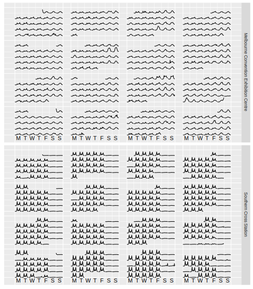

<!-- README.md is generated from README.Rmd. Please edit that file -->
sugrrants
=========

[](https://travis-ci.org/earowang/sugrrants)

Overview
--------

The goal of *sugrrants* is to provide supporting graphics with R for analysing time series data. It aims to fit into the *tidyverse* and grammar of graphics framework for handling with temporal data. The package is under development and highly experimental at this stage. Bug reporting and feature suggestions are welcome.

Installation
------------

You could install the development version from Github using

``` r
# install.packages("devtools")
devtools::install_github("earowang/sugrrants", build_vignettes = TRUE)
```

Usage
-----

### Calendar-based graphics

``` r
library(dplyr)
#> 
#> Attaching package: 'dplyr'
#> The following objects are masked from 'package:stats':
#> 
#>     filter, lag
#> The following objects are masked from 'package:base':
#> 
#>     intersect, setdiff, setequal, union
library(sugrrants)
#> Loading required package: ggplot2

calendar_df <- pedestrian %>%
  filter(Sensor_ID %in% c(9, 25)) %>%
  group_by(Sensor_Name) %>%
  frame_calendar(
    x = Time, y = Hourly_Counts, date = Date_Time, calendar = "monthly")
calendar_df
#> # A tibble: 24,809 x 12
#> # Groups:   Sensor_Name [2]
#>              Date_Time  Year   Month Mdate    Day  Time Sensor_ID
#>                 <dttm> <int>   <ord> <int>  <ord> <int>     <int>
#>  1 2016-01-01 00:00:00  2016 January     1 Friday     0         9
#>  2 2016-01-01 00:00:00  2016 January     1 Friday     0        25
#>  3 2016-01-01 01:00:00  2016 January     1 Friday     1         9
#>  4 2016-01-01 01:00:00  2016 January     1 Friday     1        25
#>  5 2016-01-01 02:00:00  2016 January     1 Friday     2         9
#>  6 2016-01-01 02:00:00  2016 January     1 Friday     2        25
#>  7 2016-01-01 03:00:00  2016 January     1 Friday     3         9
#>  8 2016-01-01 03:00:00  2016 January     1 Friday     3        25
#>  9 2016-01-01 04:00:00  2016 January     1 Friday     4         9
#> 10 2016-01-01 04:00:00  2016 January     1 Friday     4        25
#> # ... with 24,799 more rows, and 5 more variables: Sensor_Name <chr>,
#> #   Hourly_Counts <int>, .group_id <dbl>, .x <dbl>, .y <dbl>
```

``` r
p <- calendar_df %>%
  ggplot(aes(x = .x, y = .y, group = .group_id)) +
  geom_line() +
  facet_grid(Sensor_Name ~ .)
prettify(p, label = "text")
```



Acknowledgements
----------------

The acronym of *sugrrants* is **SU**pporting **GR**aphics with **R** for **AN**alysing **T**ime **S**eries, pronounced as "sugar ants" that are a species of ant endemic to Australia. Naming credit goes to @robjhyndman.
